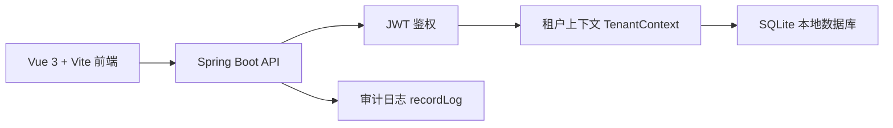
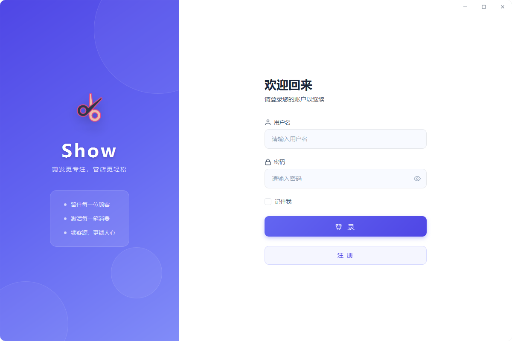
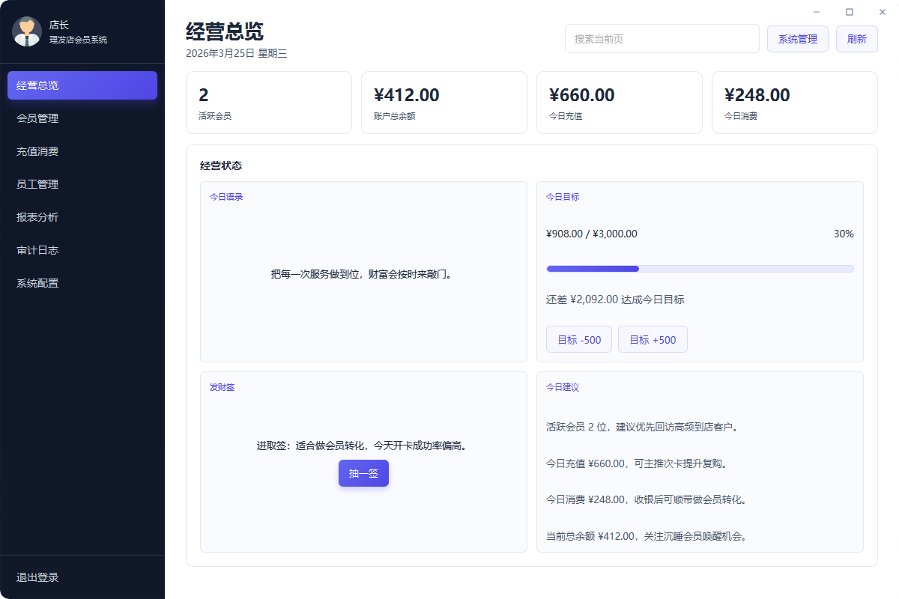
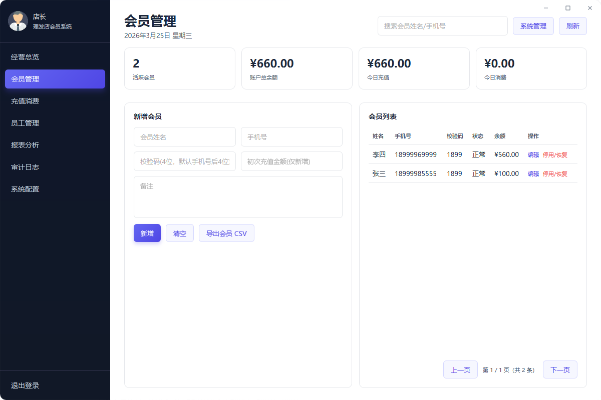
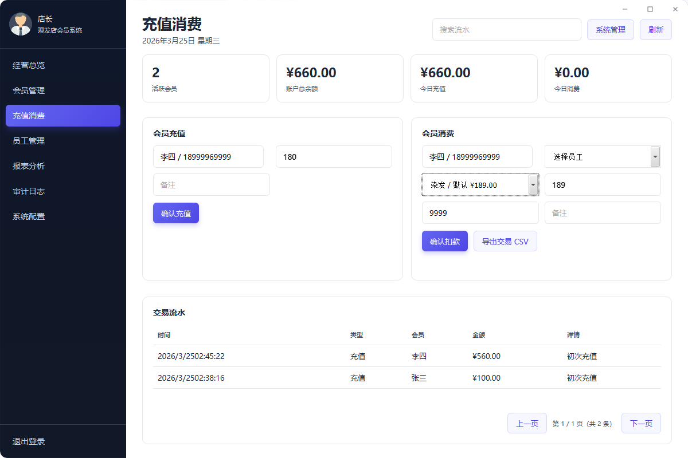
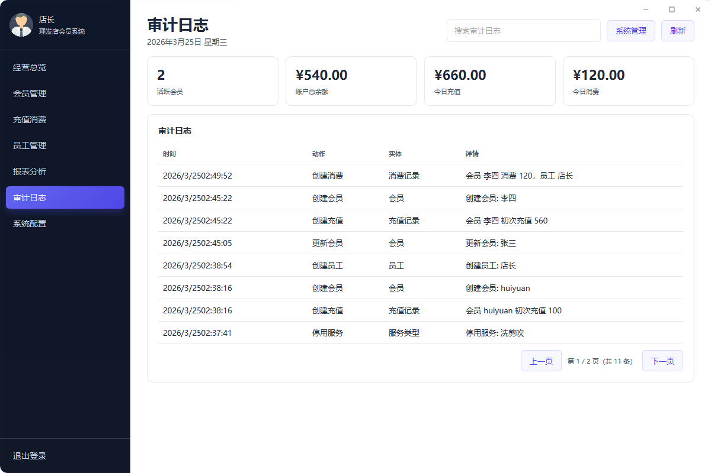
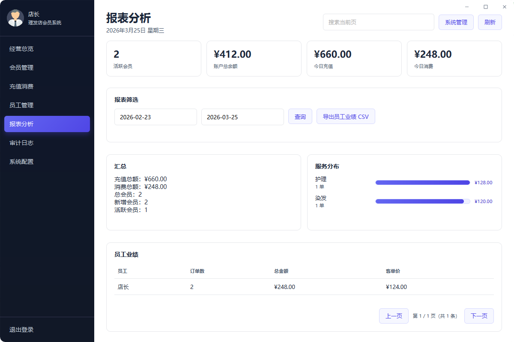

# Show · 理发店极简会员管理系统

> 面向中小理发店、社区店、夫妻店的一体化轻量客户管理工具。  
> 目标是：安装即用、操作直接、数据清晰、成本可控。


## 为什么是它

- 不依赖外部数据库服务，内置 SQLite，单机可运行，维护门槛低。
- 登录、注册、JWT 鉴权、租户隔离完整闭环，避免“裸奔接口”。
- 聚焦理发店高频场景：会员、充值、消费、员工、服务、业绩、审计。
- UI 统一为简洁时尚风格，减少培训成本，新员工也能快速上手。

## 主要功能

- 账号体系
  - 店长账号注册与登录
  - 修改密码
  - 所有业务接口默认鉴权（除登录/注册）
- 会员管理
  - 新增/编辑会员、状态切换、分页查询
  - 支持设置 4 位校验码（默认手机号后四位）
  - 新增会员可直接录入初次充值金额
- 充值与消费
  - 会员下拉支持模糊检索（姓名/手机号）
  - 消费时强校验会员校验码（与后端存储值比对）
  - 交易流水分页查询与导出
- 员工与服务
  - 员工管理、服务类型管理（均支持分页）
  - 注册后自动初始化默认服务类型（按租户）
- 统计与审计
  - 经营概览、服务分布、员工业绩（分页）
  - 审计日志分页，关键操作可追溯

## 系统架构



- 前端：`frontend`（Vue 3 单页应用）
- 后端：`src/main/java`（Spring Boot + JDBC）
- 数据库：SQLite（默认文件位于 `${user.home}/.show/show.db`）
- 租户隔离：所有核心业务表包含 `tenant_id`
- 安全策略：JWT 承载租户信息（加密后写入 token claim）

## 数据模型（核心表）

- `t_manager`：店长账号
- `t_customer`：会员（含 `verify_code`）
- `t_employee`：员工
- `t_service_type`：服务类型
- `t_recharge_record`：充值记录
- `t_consume_record`：消费记录
- `t_audit_log`：审计日志

建表脚本见：`src/main/resources/schema.sql`

## 依赖与版本

### 后端

- Java 17
- Spring Boot 3.1.5
- sqlite-jdbc 3.46.0.0
- JJWT 0.12.5
- Maven Compiler Plugin 3.11.0
- JavaFX 17.0.2（桌面壳相关）

### 前端

- Node.js 18+（建议）
- Vue 3.4.x
- Vue Router 4.3.x
- Vite 5.4.x
- @vitejs/plugin-vue 5.0.x

## 本地运行

1. 安装 JDK 17、Node.js、Maven。
2. 执行前端构建：`frontend` 目录 `npm install` + `npm run build`。
3. 执行后端启动或打包（见下节）。
4. 首次运行会自动创建数据库目录与表结构。

## 一键打包

项目已提供脚本：`compile_all.ps1`

```powershell
.\compile_all.ps1
```

脚本会依次完成：

1. 前端构建
2. 后端 Maven 打包
3. jpackage 生成应用目录
4. 输出 `Show.zip` 与 `Show.exe`

## 截图展示

- 登录页与注册弹窗  
  
- 工作台总览  
  
- 会员管理与模糊检索下拉  
  
- 充值/消费与校验码校验  
  
- 统计报表与审计日志  
  `
  `

## 项目亮点

- 极简上手：围绕理发店真实日常，不做过度设计。
- 安全可用：统一鉴权 + 审计日志 + 租户隔离。
- 离线友好：SQLite 本地持久化，无需单独部署数据库。
- 可打包分发：可直接产出可执行程序，适合门店终端落地。

## 后续演进方向

- 多角色权限（店长/店员）与细粒度菜单权限。
- 会员标签、回访提醒、生日关怀、沉睡唤醒。
- 套餐卡/次卡/折扣券/积分体系。
- 收银扩展：多支付方式、交班对账、日结报表。
- 数据备份恢复、门店迁移、云端同步。
- 连锁门店管理：跨店汇总、店铺维度经营分析。

## License

MIT

